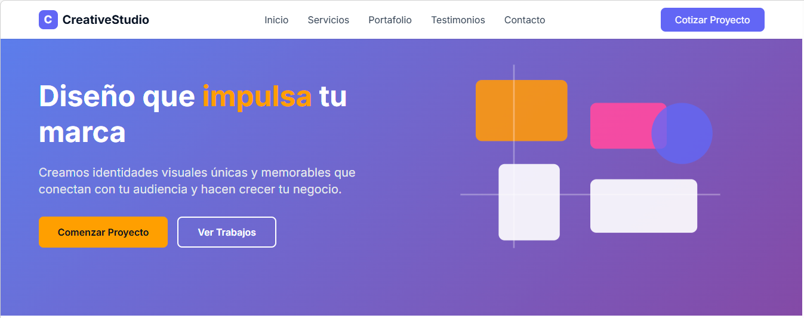
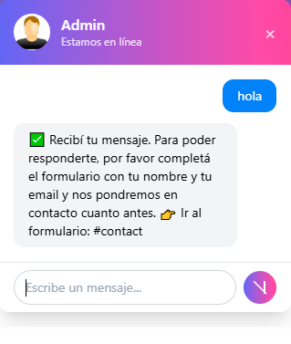
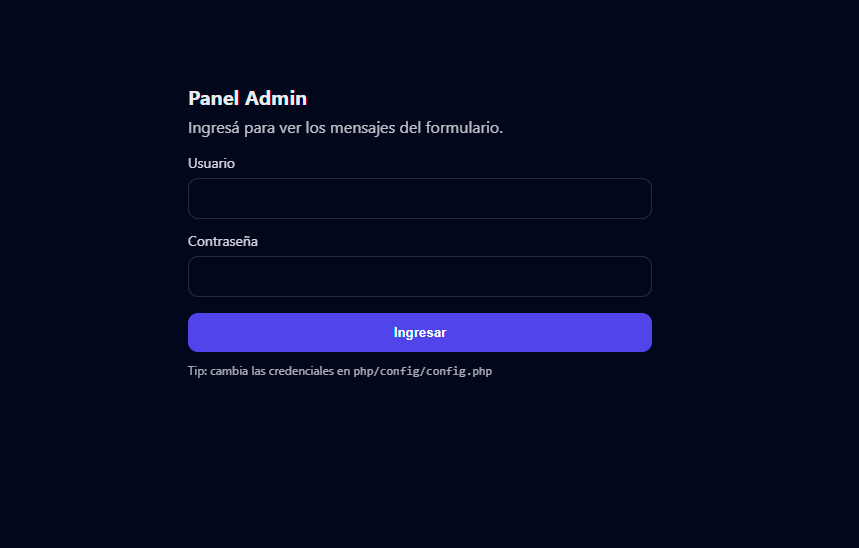
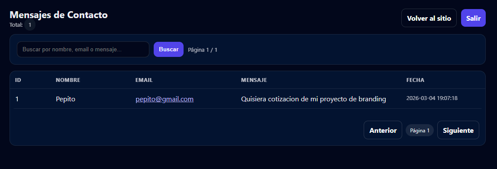

# CreativeStudio

Full-stack portfolio project: responsive landing page for creative services with contact form, MySQL backend, admin panel and interactive chat widget.

---

# Features

### Landing Page
- Responsive layout
- Clean UI focused on creative services
- Smooth navigation and modern styling

### Contact Form
- Basic validation
- Stores messages in MySQL database
- Uses **PDO with prepared statements**
- Supports both **traditional form submission** and **fetch() requests**

### Admin Panel
- Secure login with PHP sessions
- View messages submitted from the contact form
- Search functionality
- Pagination for message listing

### Chat Widget
- Interactive chat UI
- Automatic reply message
- Direct link to the contact form section
- Messages stored in database
- Automatic cleanup of chat messages older than **7 days**

---

# Technologies

- HTML
- CSS
- JavaScript (Vanilla JS)
- PHP (PDO)
- MySQL
- XAMPP (local development environment)

---

# Project Structure
```bash
CreativeStudio/
│
├── index.html
├── README.md
├── .gitignore
│
├── admin/
│   ├── login.php
│   ├── logout.php
│   └── messages.php
│
├── assets/
│   ├── css/
│   │   └── style.css
│   ├── js/
│   │   └── main.js
│   └── img/
│       └── chat-user.jpg
│
└── php/
    ├── admin/
    │   └── auth.php
    ├── chat/
    │   ├── get.php
    │   └── send.php
    ├── config/
    │   ├── config.example.php
    │   ├── config.php
    │   └── response.php
    └── contact/
        └── save.php
```


---

# Installation (XAMPP)

### 1 Clone the repository

```bash
git clone https://github.com/maxi-design/CreativeStudio.git
```


---

### 2 Move the project folder to

C:\xampp\htdocs\


---

### 3 Start XAMPP

Enable:

- Apache
- MySQL

---

### 4 Create the database

Open **phpMyAdmin** and create a database named:

creativestudio


---

### 5 Create tables

Create the following tables:

- `contact_messages`
- `chat_messages`

If you already created them during development you can skip this step.

---

### 6 Configure credentials

Copy:

php/config/config.example.php

Rename it to:


php/config/config.php


Then edit the database credentials and admin password hash.

---

### 7 Run the project

Website:


http://localhost/CreativeStudio/

Admin panel:


http://localhost/CreativeStudio/admin/login.php


---

# Security Notes

- `config.php` is ignored by Git to prevent exposing credentials.
- `config.example.php` is included as a configuration template.

---

## Screenshots

### Landing Page


### Chat Widget


### Admin Login


### Admin Panel


# Author

Portfolio project developed as part of full-stack practice and job applications.